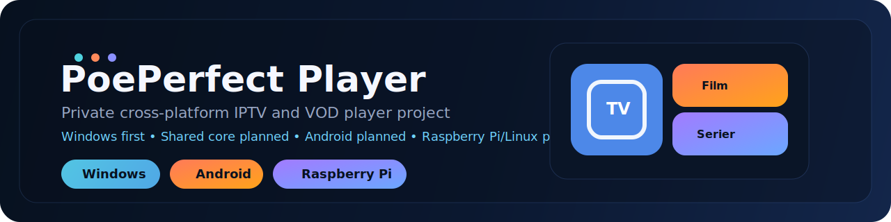

<p align="center">
  
</p>

<h1 align="center">PoePerfect Player</h1>

<p align="center">
  Private multi-platform IPTV/VOD player project for Windows, Web, Android, and future TV/Linux targets.
</p>

<p align="center">
  Windows desktop app - Web/browser app - Android MVP - Shared core services
</p>

## Overview

`PoePerfect Player` is being built as one product with multiple platform frontends in the same private repository.

The main working products today are the Windows desktop app, the Web app, and the Android app. The Web version remains the fastest place to test TV/player ideas and the foundation for a future webOS/TV version. Android has now caught up on the core VOD browsing path, while the shared Core project keeps reusable playlist, cache, and Xtream logic out of platform-specific UI code.

## Current Status

| Area | Status | Notes |
| --- | --- | --- |
| Windows desktop app | Active | Main WPF player with playlist browsing, VOD details, playback, favorites, EPG/cache support, and installer output |
| Web app | Active MVP | React/Vite browser version with Live/Film/Serier browsing, playlist management, search, details, playback, and a local dev gateway for MKV/HLS testing |
| Android app | Active MVP | .NET MAUI app for playlist loading, fast cached browsing, search/filtering, favorites, enriched VOD details, embedded playback, and external fallback |
| Shared Core | Active | Shared playlist parsing, models, favorites, cache/indexing and Xtream-related services |
| Raspberry Pi/Linux | Planned | Future lightweight/player target |
| GitHub repository | Private | Product repo for all versions |

## Implemented Capabilities

### Windows

- M3U playlists from URL or file
- Xtream-style playlist/API support where available
- Live TV, Film, and Serier sections
- latest-added category for Film and Serier
- category browsing with local sort/hide preferences
- favorites and recent playback
- movie detail view with larger poster, description, metadata, rating, cast, play, and heart favorite toggle
- series grouping with seasons and episodes
- fullscreen playback
- audio track and subtitle selection for VOD
- optional XMLTV/EPG for Live TV
- local caching for playlists, posters, and guide data
- custom Windows app icon
- Windows installer output

### Web

- React/Vite browser app under `src/PoePerfect.Player.Web`
- M3U/Xtream source loading
- playlist page for loading sources and sorting/hiding undercategories
- Windows-inspired start page with Live, Film, and Serier
- TV-style category browser with latest-added, favorites, recent playback, debounced search, cleaned titles, metadata chips, and poster placeholders
- movie detail view with cleaned title, metadata chips, poster, description, rating, cast, play, resume prompt, and heart favorite toggle
- series detail view with seasons and episodes
- video player using browser playback plus `hls.js`
- TV-style audio and subtitle picker panels in the player, shown only when selectable tracks exist
- embedded MKV audio/subtitle discovery in dev mode through local `ffprobe`
- subtitle timing adjustment controls and configurable bottom placement behavior around controls
- auto-hiding player chrome/topbar while the pointer is idle, with click-to-play/pause on the video surface
- loading/buffering spinner for catalog, details, player start, seek, and gateway restarts
- local dev gateway for MKV playback with selectable audio/subtitle streams converted to HLS/WebVTT
- local browser storage for source, favorites, recent playback, watch progress, and category preferences
- Vite dev proxy for catalog/API loading, gateway playback, subtitle probing/extraction diagnostics, and player logging during local testing
- intended as the base for a future webOS/TV package

### Android

- .NET MAUI Android MVP
- load playlist from M3U URL or file path
- browse Live, Film, and Serier
- search/filter channels and VOD
- save favorites locally with heart toggles
- latest-added, favorites, and recent playback categories, with Film/Serier opening on the 20 latest-added items
- cached latest-added previews for faster first section opens after a playlist has been indexed
- compact search toggle above the category strip
- cleaned VOD titles with compact metadata chips
- movie detail step before playback with poster, plot, genre, duration, rating, release date, director, cast, play, and heart favorite toggle
- loading feedback while opening sections, details, categories, and returning from details
- series grouping with seasons and episodes
- embedded Android playback with external player/browser fallback

### Shared Core

- shared channel/content models
- M3U parsing
- favorites persistence
- playlist/cache-related services
- series grouping helpers
- Xtream API helpers for category refresh and VOD metadata

## Repository Layout

- [PoePerfect.Player.sln](./PoePerfect.Player.sln)
- [src/PoePerfect.Player.Windows](./src/PoePerfect.Player.Windows)
- [src/PoePerfect.Player.Web](./src/PoePerfect.Player.Web)
- [src/PoePerfect.Player.Android](./src/PoePerfect.Player.Android)
- [src/PoePerfect.Player.Core](./src/PoePerfect.Player.Core)
- [src/PoePerfect.Player.RaspberryPi](./src/PoePerfect.Player.RaspberryPi)
- [installer](./installer)
- [docs](./docs)

## Run Locally

### Windows

From the repository root:

```powershell
dotnet run --project .\src\PoePerfect.Player.Windows\PoePerfect.Player.Windows.csproj
```

Or start the built app directly after a Debug build:

```powershell
C:\projectpeo\APTV\src\PoePerfect.Player.Windows\bin\Debug\net8.0-windows\PoePerfectPlayer.exe
```

### Web

From the repository root:

```powershell
cd .\src\PoePerfect.Player.Web
npm install
npm run dev
```

The local dev server defaults to:

```text
http://127.0.0.1:5173
```

Build the web app with:

```powershell
npm run build
```

During `npm run dev`, the Web app also exposes local-only helper routes:

- `/api/proxy` for playlist/catalog/API requests that need a browser-safe proxy
- `/api/gateway/*` for MKV gateway testing through local `ffmpeg`
- `/api/subtitles/*` for local `ffprobe` media-track discovery and subtitle diagnostics
- `/api/client-log` for player diagnostics in the Vite console

The gateway is intended for local development. It starts one local `ffmpeg` session per active gateway playback, converts the selected MKV video/audio/subtitle stream to browser-friendly HLS, and restarts at the requested absolute position when the user seeks or switches embedded tracks.

### Android

Build the Android project with:

```powershell
dotnet build .\src\PoePerfect.Player.Android\PoePerfect.Player.Android.csproj
```

Running on a device/emulator is usually easiest from Visual Studio with the Android workload installed.

## Build

Build the .NET solution:

```powershell
dotnet build .\PoePerfect.Player.sln
```

Build the Web app:

```powershell
cd .\src\PoePerfect.Player.Web
npm run build
```

## Installer

The Windows installer build script is:

- [build-installer.ps1](./installer/build-installer.ps1)

Installer output is written to:

- `dist\PoePerfectPlayer-Setup.exe`

## Local User Data

Windows runtime user data is stored under:

- `%AppData%\APTV`

That includes:

- saved playlist URL
- saved XMLTV URL
- favorites
- recent playback
- caches
- logs

The Web app uses browser local storage for:

- saved source URL
- favorites
- recent playback
- watch progress / continue watching
- category visibility/order preferences

These are runtime values and should not be committed to the repository.

## Screenshots

This repository is ready for a proper screenshots section, but real product captures have not been added yet.

Recommended screenshots to add next:

- Windows home screen with `Live`, `Film`, and `Serier`
- Web home screen with the three main category cards
- category browsing view for `Film` or `Serier`
- movie detail view
- fullscreen player with audio/subtitle controls
- `Live` list view with channel icons and EPG

## Platform Roadmap

| Platform | Stage | Direction |
| --- | --- | --- |
| Windows | Active | Continue polishing the main app |
| Web | Active MVP | Bring structure and behavior closer to Windows, then use it as the webOS foundation |
| Android | Active MVP | Continue polishing playback, continue watching, and embedded audio/subtitle selection after the browsing/detail UX catch-up |
| Shared Core | Active | Move more reusable logic out of platform-specific projects |
| Raspberry Pi/Linux | Planned | Evaluate after Web/Core are further along |
| webOS/TV | Planned | Package the browser app for TV after Web is mature enough |

## Documentation

- [Project history](./docs/poeperfect-player-history.md)
- [Licensing handoff](./docs/licensing-handoff.md)
- [Repository roadmap](./docs/repository-roadmap.md)
- [Web/webOS player context](./docs/webos-player-context.md)
- [Cross-platform UX porting plan](./docs/cross-platform-ux-porting-plan.md)
- [Release checklist](./docs/release-checklist.md)
- [Private repository notice](./LICENSE.md)

## Notes

- No personal playlist URLs, usernames, passwords, or tokens should be stored in the repository.
- The app is designed so end users enter their own playlist and optional XMLTV source.
- `node_modules`, `dist`, logs, build outputs, and local runtime caches are intentionally ignored.
- This repository is private and intended to hold all future `PoePerfect Player` platform versions.
